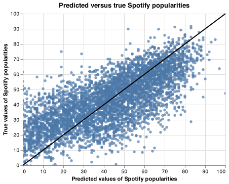

```{r setup, include=FALSE}
knitr::opts_chunk$set(echo = FALSE)
library(knitr)
library(kableExtra)
library(tidyverse)
library(caret)
```

# Summary

We use Ridge algorithm here to build a regression model to predict the popularity of spotify tracks based on features like danceability, loudness, tempo etc. The popularity score ranges from 0 to 100. A popularity score of 0 means the the song has minute popularity and a popularity score of 100 means the song is extremely popular.

# Introduction

Some songs sit atop popularity charts like the Billboard charts while certain other songs comfortably sit at the bottom of the charts. Some songs don't even chart at all. This pose an interesting question to us on what exactly makes a song popular and we ask if we can be able to predict how popular a song will get. based on certain features. Some songs are unexceptionally popular while some other songs are not as popular. This is an attempt to answer this interesting question. We attempt here to make a prediction on the popularity of a song based on certain features.

According to this [report](https://www.musicbusinessworldwide.com/over-60000-tracks-are-now-uploaded-to-spotify-daily-thats-nearly-one-per-second/ "www.musicbusinessworldwide.com"), approximately 137 million new songs are released every year, and only about 14 records have sold 15 million physical copies or more in global history. Therefore, it is important to determine what exactly determines a track popularity and specifically make predictions on how popular a song will get based on based on features like danceability, loudness, tempo etc.

# Methods

## Data

The dataset used in this project was sourced from Tidy Tuesday's github repo [here](https://github.com/rfordatascience/tidytuesday/blob/master/data/2021/2021-09-14/readme.md), and particularly [here](https://query.data.world/s/gvgzoh3hhfj4lg4rbv3x4ah6rm6ta4). The data, however, originally comes from [Data.World](https://data.world/kcmillersean/billboard-hot-100-1958-2017#), [Billboard.com](http://billboard.com/) and Spotify. Each row from the dataset represents a song's features and a target column specifying the song's popularity on a scale of 0 (least popularity) to 100 (most popularity).

## Analysis

Ridge model was built to answer our research question (to predict spotify tracks popularity). This is a regression solution and predictions range from 0 (least popularity) to 100 (most popularity). All features in the original dataset were used to fit the model with the exceptions of 'song_id', 'spotify_track_id', 'spotify_track_album' features. A 10-fold cross-validation was used for hyperparameter optimization. The code used to perform this analysis can be found [here](https://github.com/UBC-MDS/DSCI_522_Spotify_Track_Popularity_Predictor/blob/main/src/preprocess_n_model.py).

# Results & Discussion

It is usually very important to look at how the features are co-related and to see what their pairwise distributions look like. Here, the blue plots (and a fitting line) represents the paired distributions of the features, and the other boxes are the paired correlations of the features. As can be seen, the correlations are fair and not unreasonable, hence the features can be used together for building the Ridge model that seeks to answer the predictive question.

```{r paired_distribution_and_correlation, echo=FALSE, fig.cap="Figure 1. Pairwise distributions and correlations of all features", out.width = '100%'}
knitr::include_graphics("../results/paired_distribution_and_correlation.png")
```

We adopted a simple linear regression model - Ridge algorithm. Our choice of Ridge stems from the fact it it is regularized and take care of the multi-collinearity problem. A 10-fold cross validation was carried out and the train and validation $R^2$ scores reported in the table below from cross-validation

```{r cross-validation, echo=FALSE, message=FALSE, warning=FALSE}
kable(read_csv("../results/cv_df.csv"), caption = "Table 1. Train and validation scores from cross-validation") %>%
  kable_styling(full_width = FALSE)
```

The following table shows the results of RandomizedSearchCV for determining the best hyperparameters for the Ridge model.

```{r best_hyperparameters, echo=FALSE, message=FALSE, warning=FALSE}
kable(read_csv("../results/best_hyperparameters.csv"), caption = "Table 2. Best hyperparameters from RandomizedSearchCV") %>%
  kable_styling(full_width = FALSE)
```

In order to evaluate the performance of our model, we made some predictions and compared the predicted values with the actual values. We have plotted this below. The Goodness of Fit below is not unreasonable and shows the viability of the ridge model.

```{r predict_vs_test, echo=FALSE, fig.cap="Figure 2. Comparison of actual vs. predicted values", out.width = '100%'}

```

In order to improve this model in the future where we can have excellent reliability on the model predictions, we will need the right combination of data. The data used here are mostly Spotify and Billboard-based. In the future, we'll look at aggregating data from other sources as well. Also, the ridge model deployed did not perform greatly, we'll look into more sophisticated feature engineering and model training in the future.

# References
